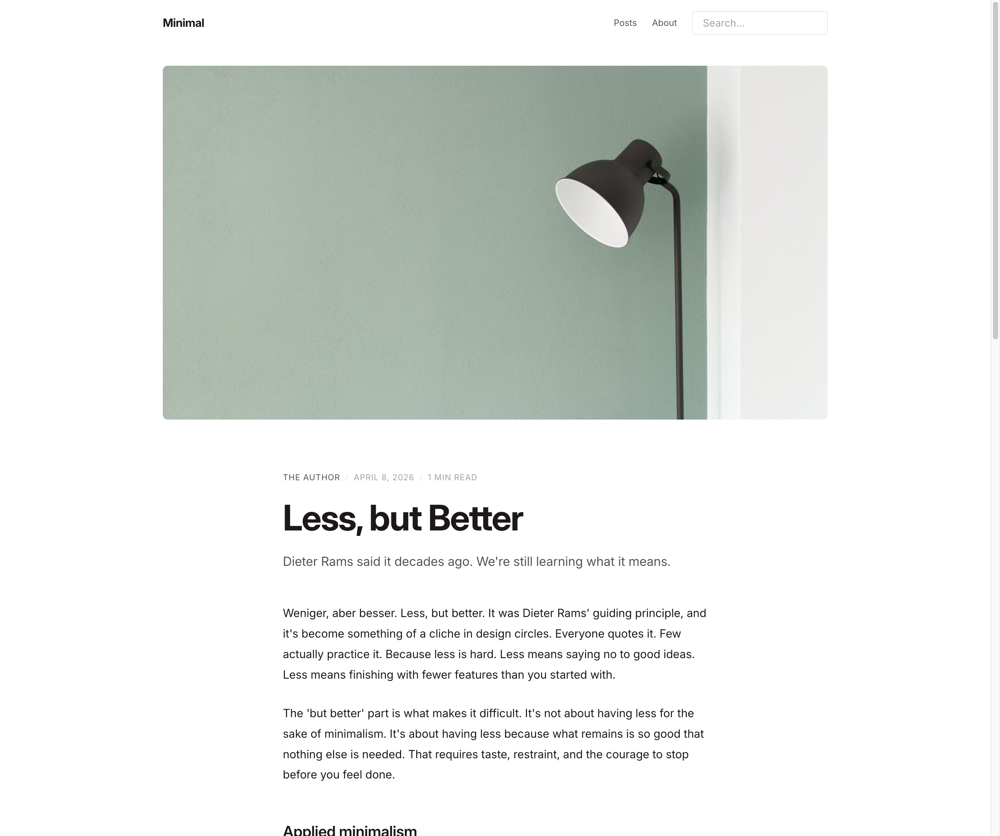
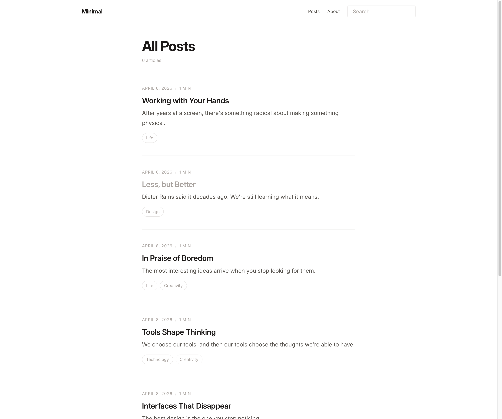

# Minimal Blog — EmDash Theme

A modern, minimal blog theme for [EmDash CMS](https://emdashcms.com).




## Quick Start

```bash
npm create astro@latest -- --template github:nozo-moto/emdash-theme-minimal-blog
cd my-blog
npm install
npm run bootstrap
npm run dev
```

Open http://localhost:4321 and complete the Setup Wizard.

## License

MIT
